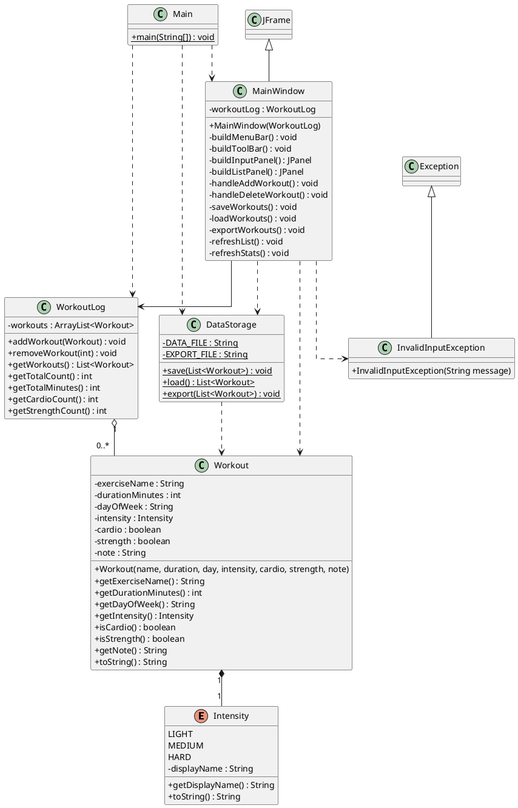
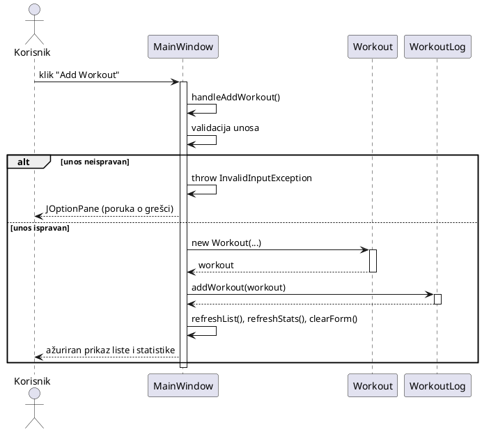
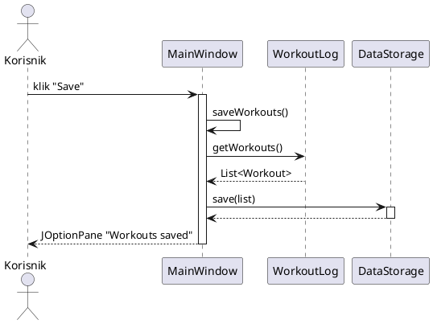

# WorkoutLog — Dokumentacija projekta

**Sveučilište u Zadru**
Smjer Informacijske tehnologije
Kolegij: *Osnove objektnog programiranja*
Mentor: doc. dr. sc. Ante Panjkota
Student: Marko Baranašić

---

## Sadržaj

1. [Opis problema](#1-opis-problema)
2. [Konceptualni model rješenja](#2-konceptualni-model-rješenja)
3. [UML dijagram klasa](#3-uml-dijagram-klasa)
4. [Sekvencijski dijagram](#4-sekvencijski-dijagram)
5. [Wireframe korisničkog sučelja](#5-wireframe-korisničkog-sučelja)
6. [Korištene tehnologije i OOP koncepti](#6-korištene-tehnologije-i-oop-koncepti)

---

## 1. Opis problema

Mnogi pojedinci koji redovito vježbaju ne vode nikakvu evidenciju o svojim treninzima. Bez zapisa o tome što su, kada i koliko vježbali, teško je pratiti vlastiti napredak, uočiti obrasce i planirati buduće aktivnosti.

Postojeća rješenja, uglavnom mobilne aplikacije, često su prekomplicirana za svakodnevnu upotrebu ili zahtijevaju registraciju korisničkog računa i stalnu internet vezu. To predstavlja nepotrebnu prepreku korisniku koji želi samo brzo zabilježiti odrađeni trening.

**WorkoutLog** rješava ovaj problem kao jednostavna desktop aplikacija koja:

- ne zahtijeva internet vezu ni registraciju,
- pohranjuje sve podatke lokalno na korisnikovom računalu,
- nudi pregledan prikaz svih unesenih treninga,
- prikazuje sažetu statistiku,
- omogućuje izvoz podataka u čitljiv tekstualni format.

Cilj aplikacije je korisniku olakšati praćenje napretka i izgradnju redovitih sportskih navika kroz minimalno i jednostavno sučelje.

---

## 2. Konceptualni model rješenja

Aplikacija je strukturirana po principu **troslojne arhitekture**, uz jasno odvajanje odgovornosti. Svaka klasa ima jednu, jasno definiranu zadaću.

### 2.1. Klase i odgovornosti

| Sloj | Klasa | Odgovornost |
|------|-------|-------------|
| Model | `Workout` | Predstavlja jedan trening (podatkovni model). |
| Model | `Intensity` | Nabrojani tip (enum) razine intenziteta: LIGHT, MEDIUM, HARD. |
| Logika | `WorkoutLog` | Drži listu svih treninga i računa statistiku. |
| Logika | `DataStorage` | Spremanje, učitavanje i izvoz podataka u datoteke. |
| Logika | `InvalidInputException` | Vlastita iznimka za neispravan korisnički unos. |
| Prezentacija | `MainWindow` | Swing grafičko korisničko sučelje. |
| Pokretanje | `Main` | Ulazna točka aplikacije (učitava podatke i otvara prozor). |

### 2.2. Odnosi među klasama

- `Workout` **sadrži** jedan `Intensity` (kompozicija — intenzitet je dio treninga).
- `WorkoutLog` **agregira** više objekata `Workout` (u `ArrayList<Workout>`).
- `MainWindow` **koristi** `WorkoutLog` (drži referencu na njega) te **poziva** `DataStorage` za rad s datotekama i `Workout` pri stvaranju novog unosa.
- `DataStorage` **operira nad** listom `Workout` objekata.
- `InvalidInputException` **nasljeđuje** `Exception`.
- `Main` **stvara** `WorkoutLog` i `MainWindow`.

### 2.3. Tok podataka

1. Pri pokretanju `Main` poziva `DataStorage.load()` koji čita spremljene treninge iz binarne datoteke u `WorkoutLog`.
2. Korisnik u `MainWindow` unosi podatke i klikom na **Add Workout** pokreće validaciju. Ako je unos ispravan, stvara se novi `Workout` i dodaje u `WorkoutLog`.
3. `MainWindow` osvježava prikaz liste i statistike iz `WorkoutLog`.
4. Klikom na **Save** podaci se preko `DataStorage.save()` zapisuju u binarnu datoteku, a klikom na **Export** preko `DataStorage.export()` u tekstualnu datoteku.

---

## 3. UML dijagram klasa

### 3.1. Tekstualni prikaz

```
Main
  └─ koristi → WorkoutLog, MainWindow, DataStorage

MainWindow (extends JFrame)
  ├─ ima → WorkoutLog
  └─ koristi → DataStorage, Workout, Intensity, InvalidInputException

WorkoutLog
  └─ sadrži → ArrayList<Workout>   (0..*)

Workout (implements Serializable)
  └─ ima → Intensity

DataStorage
  └─ operira nad → List<Workout>

InvalidInputException  ──▷  Exception      (nasljeđivanje)
MainWindow             ──▷  JFrame         (nasljeđivanje)
```

### 3.2. PlantUML verzija



> PlantUML kod možeš zalijepiti na [plantuml.com](https://www.plantuml.com/plantuml) ili u IntelliJ PlantUML dodatak da dobiješ sliku dijagrama.

---

## 4. Sekvencijski dijagram

Prikazan je glavni scenarij aplikacije: **dodavanje novog treninga**.

### 4.1. Tekstualni prikaz

1. Korisnik klikne gumb **Add Workout**.
2. `MainWindow` poziva svoju metodu `handleAddWorkout()`.
3. `MainWindow` provjerava (validira) unesene podatke.
4. Ako je unos neispravan → baca se `InvalidInputException` i korisniku se prikazuje poruka o grešci (`JOptionPane`).
5. Ako je unos ispravan → stvara se novi objekt `Workout`.
6. `MainWindow` poziva `workoutLog.addWorkout(workout)`.
7. `MainWindow` osvježava listu i statistiku te prazni formu.

### 4.2. PlantUML verzija



### 4.3. Dodatni scenarij: spremanje u datoteku



---

## 5. Wireframe korisničkog sučelja

Aplikacija se sastoji od jednog glavnog prozora podijeljenog na dva dijela, s izbornikom i alatnom trakom na vrhu.

### 5.1. ASCII prikaz

```
+------------------------------------------------------------------+
|  WorkoutLog                                            [_] [#] [X]|
+------------------------------------------------------------------+
| File   Help                                                      |  <- JMenuBar
+------------------------------------------------------------------+
| [ Save ]  [ Load ]  [ Export ]                                   |  <- JToolBar
+-------------------------------+----------------------------------+
|  Log Workout                  |  Logged Workouts                 |
|                               | +------------------------------+ |
|  Exercise name: [__________]  | | Running  | Monday | 30 min...| |
|  Duration (min):[__________]  | | Push-ups | Wed    | 20 min...| |
|  Day:           [ Monday  v]  | | Cycling  | Friday | 45 min...| |
|  Intensity:  (o) Light        | |                              | |
|              (*) Medium       | |                              | |
|              (o) Hard         | +------------------------------+ |
|  Category:   [ ] Cardio       | [   Delete Selected   ]          |
|              [ ] Strength     | +-- Summary -------------------+ |
|  Note:       [____________]   | | Total workouts: 3            | |
|              [____________]   | | Total minutes: 95            | |
|                               | | Cardio sessions: 2           | |
|  [       Add Workout       ]  | | Strength sessions: 1         | |
|                               | +------------------------------+ |
+-------------------------------+----------------------------------+
```

### 5.2. Opis komponenti

| Komponenta | Swing element | Namjena |
|------------|---------------|---------|
| Naziv vježbe | `JTextField` | Unos naziva vježbe |
| Trajanje | `JTextField` | Unos trajanja u minutama |
| Dan | `JComboBox` | Odabir dana u tjednu (Monday–Sunday) |
| Intenzitet | `JRadioButton` ×3 | Odabir jedne razine: Light / Medium / Hard |
| Kategorija | `JCheckBox` ×2 | Označavanje: Cardio i/ili Strength |
| Bilješka | `JTextArea` | Slobodan tekst o treningu |
| Add Workout | `JButton` | Dodavanje treninga u listu |
| Lista treninga | `JList` | Prikaz svih unesenih treninga |
| Delete Selected | `JButton` | Brisanje odabranog treninga |
| Summary | `JLabel` ×4 | Prikaz statistike |
| Izbornik | `JMenuBar` | File (Save, Load, Export, Exit) i Help (About) |
| Alatna traka | `JToolBar` | Brzi gumbi: Save, Load, Export |

---

## 6. Korištene tehnologije i OOP koncepti

### 6.1. Tehnologije

| Tehnologija | Primjena |
|-------------|----------|
| Java (JDK 25) | Programski jezik |
| Swing (`javax.swing`) | Grafičko korisničko sučelje |
| AWT (`java.awt`) | Raspored komponenti, događaji |
| `java.io` | Serijalizacija i rad s datotekama |
| `java.util` | Kolekcija `ArrayList` |

### 6.2. OOP koncepti

| Koncept | Gdje je primijenjen |
|---------|---------------------|
| **Enkapsulacija** | Privatna polja + getteri u `Workout`, `WorkoutLog` |
| **Nasljeđivanje** | `InvalidInputException extends Exception`, `MainWindow extends JFrame` |
| **Polimorfizam (override)** | `toString()` u `Workout` i `Intensity` |
| **Apstrakcija** | Vraćanje sučelja `List` umjesto konkretnog `ArrayList` |
| **Enumeracije** | `Intensity` (tip-sigurnost) |
| **Obrada iznimaka** | `try-catch` za `InvalidInputException`, `IOException`, `ClassNotFoundException` |
| **Kolekcije** | `ArrayList<Workout>` u `WorkoutLog` |
| **Rad s datotekama** | Binarna serijalizacija + tekstualni izvoz u `DataStorage` |
